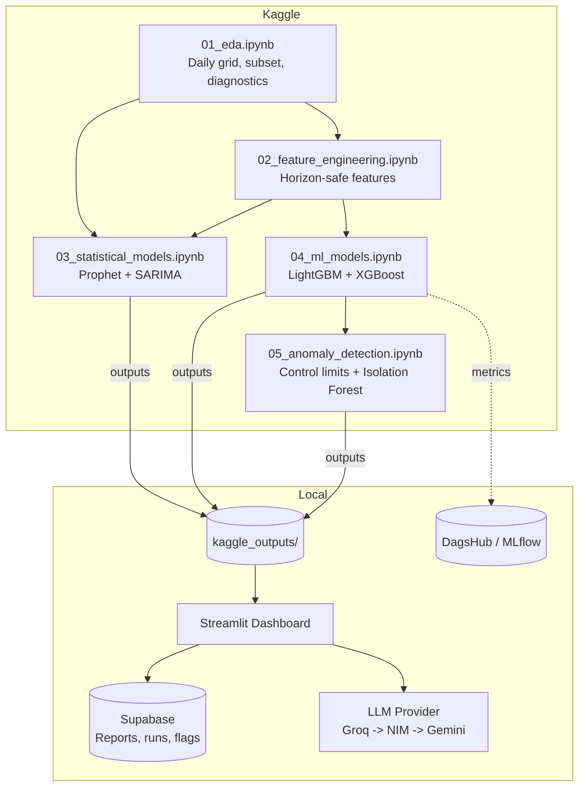

# DemandLens

**Retail Demand Forecasting & Anomaly Benchmark**

A retail demand forecasting and anomaly detection pipeline that benchmarks Prophet, SARIMA, LightGBM, and XGBoost across 60 retail series using expanding-window walk-forward cross-validation. It uses Kaggle’s free notebooks for training, Supabase’s free Postgres tier for storage, and free-tier Groq/NIM/Gemini APIs for automated reporting with provider fallback.

The project separates heavy computation from a lightweight local Streamlit dashboard. The LLM generates narrative reports and verifies every numeric claim against the original source data before displaying it. Reports are automatically saved to Supabase and can be downloaded as Markdown, including previous reports from the dashboard’s history.

## Preview

<p align="center">
  
  <br>
  <sub>Anomaly Detection view (Synthetic-Injection evaluation)</sub>
</p>

> Additional screenshots in [`assets/`](assets/), one per dashboard view.

## Architecture



## Results at a glance

From one run of notebooks 01 to 05: 60 series, 15-day holdout (Aug 1 to Aug 15, 2017, 900 rows). The dashboard shows the same figures live from `kaggle_outputs/`.

**Forecasting (holdout):**

| Model | Series | MASE | MAPE | WAPE |
|---|---|---|---|---|
| LightGBM | 60 | 0.974 | 17.88% | 17.73% |
| Prophet | 60 | 0.996 | 17.97% | 18.18% |
| **XGBoost** (selected on CV) | 60 | 1.011 | 19.44% | 18.61% |
| SARIMA | 3 | 0.838 | 13.26% | 14.84% |

Like-for-like on SARIMA's 3 series (MASE): Prophet 0.793, SARIMA 0.838, LightGBM 0.919, XGBoost 0.933.

- **No model clearly wins.** Across the 60 series, each ML model's paired MASE difference from Prophet is within noise (LightGBM minus Prophet: -0.022, 95% CI -0.110 to +0.082; XGBoost minus Prophet: +0.015, 95% CI -0.113 to +0.173). The ML models win on 58% to 60% of series and have lower median MASE (0.80 and 0.83 vs 0.91), but lose by more on the series they miss.
- **Selection ignores the holdout.** XGBoost was selected on mean MASE over the 4 CV folds (0.866 vs LightGBM 0.902). LightGBM scores slightly better on the holdout, which is why the holdout is never used for selection.
- **SARIMA covers 3 series**, so its row is not comparable to the others. Use the like-for-like line.
- **How the numbers are produced:** metrics are computed per series, then averaged, for all four models. MASE is scaled by each series' in-sample seasonal-naive (lag-7) error, so below 1 means lower error than that scale, not a measured win over a naive forecast on the holdout. The ML models forecast the window directly (lags of at least 21 days, rolling stats and oil price shifted by the horizon), so features never see in-window actuals.

**Anomaly detection (50 injected spikes and drops among 900 holdout rows):**

| Method | Precision | Recall | F1 |
|---|---|---|---|
| Control limits (k=2.5) | 0.824 | 0.84 | 0.832 |
| Isolation Forest (5% contamination) | 0.527 | 0.96 | 0.681 |

- Control limits give cleaner flags (42 true and 9 false positives). Isolation Forest catches nearly everything (48 of 50) but also flags about 43 clean rows, because its 5% contamination sets a threshold that flags about 5% of clean data by construction.
- Control limits are centered on each series' clean mean residual, so a constant forecast bias is not flagged as an anomaly.
- Scores reflect how detectable injected anomalies are, not performance on real incidents.

**Cost of error (illustrative, USD, holdout):** XGBoost about $224,480 and LightGBM about $225,702, within 0.5% of each other. These use assumed per-unit margins, not P&L data (see Known limitations). XGBoost's total absolute error is slightly lower (321,086 vs 323,350 units), while LightGBM's per-series MASE is slightly lower, because MASE weights every series equally and cost weights by volume.

## Tech stack

- **Modeling:** Prophet, statsmodels (SARIMAX), LightGBM, XGBoost, scikit-learn (IsolationForest)
- **Experiment tracking:** MLflow via DagsHub
- **Dashboard:** Streamlit + Altair (ships with Streamlit, so no extra dependency over `st.bar_chart`/`st.line_chart`)
- **Storage:** Supabase (Postgres)
- **LLM narrative:** Groq / NVIDIA NIM / Google Gemini, with automatic fallback

## Project structure

```
demand-lens/
├── kaggle/                               Runs on Kaggle, not locally
│   ├── kaggle_setup.md                   setup, secrets, inputs per notebook, run order
│   ├── requirements-ipynb.txt            version ranges for debugging installs (each notebook installs its own packages)
│   └── notebooks/
│       ├── 01_eda.ipynb                  daily grid, subsetting, activation diagnostics, STL, stationarity
│       ├── 02_feature_engineering.ipynb  horizon-safe lag/rolling/calendar features, demand patterns
│       ├── 03_statistical_models.ipynb   Prophet (60 series) + SARIMA with regressors (3 series)
│       ├── 04_ml_models.ipynb            global LightGBM + XGBoost, walk-forward CV, per-series metrics, MLflow
│       └── 05_anomaly_detection.ipynb    control limits + Isolation Forest, synthetic-anomaly eval
│
├── kaggle_outputs/                       downloaded from Kaggle after each run (git-ignored)
│
├── src/                                  local-only modules used by the dashboard
│   ├── llm/
│   │   ├── narrative.py                  facts, prompt, provider routing (Groq -> NIM -> Gemini), retry classification
│   │   └── grounding_check.py            extracts numeric claims, verifies them against the facts by type
│   ├── storage/
│   │   └── supabase_client.py            upsert/fetch forecast runs and anomaly flags, save/fetch reports
│   ├── tracking/
│   │   └── mlflow_utils.py               past DagsHub/MLflow runs for Forecast Explorer
│   └── utils/
│       ├── config.py                     loads config.yaml and env vars, resolves paths against the repo root
│       ├── metrics.py                    MAPE/WAPE/MASE, single source of truth (see scripts/sync_notebook_metrics.py)
│       └── results.py                    model selection and comparison tables, shared by dashboard and LLM facts
│
├── scripts/
│   ├── sync_notebook_metrics.py          copies src/utils/metrics.py into the notebooks that cannot import it
│   ├── smoke_test_notebook_fixes.py      runs notebook functions on synthetic data (no Kaggle needed)
│   └── _notebook_utils.py                shared .ipynb parsing helpers
│
├── dashboard/
│   ├── app.py                            st.navigation router, page config
│   ├── theme.py                          design tokens, CSS and Altair helpers
│   └── views/                            home, overview, forecast_explorer, anomaly_view, ai_report
│
├── .streamlit/config.toml                light theme, colors checked by a test against theme.py tokens
├── configs/config.yaml                   runtime settings (data files, LLM, grounding) plus notebook parameters mirrored here and test-checked
├── tests/                                52 tests, see Testing
├── .env.example                          LLM keys, Supabase URL + key, DagsHub token + repo
├── .gitignore
├── requirements.txt                      dashboard runtime dependencies
├── requirements-dev.txt                  adds pytest, scikit-learn and nbformat
└── README.md
```

## Getting started

### 1. Kaggle phase

Run notebooks `01_eda` to `05_anomaly_detection` in order on Kaggle, attaching upstream outputs as described in `kaggle/kaggle_setup.md` (inputs are found by filename, so attach exactly one version of each). Then download these 10 files from the latest run of each notebook into `kaggle_outputs/` at the repo root, so runs are never mixed: `subset_config.json`, `stationarity_results.csv`, `demand_pattern_classification.csv`, `prophet_results.csv`, `sarima_results.csv`, `ml_results.csv`, `final_holdout_predictions.parquet`, `anomaly_results.parquet`, `anomaly_eval_metrics.csv`, `cost_of_error.json`.

### 2. Local dependencies

Python 3.10 or newer.

```bash
pip install -r requirements-dev.txt
```

This adds `pytest`, `scikit-learn` and `nbformat` to the runtime dependencies. For runtime only, use `requirements.txt`.

### 3. Environment variables

```bash
cp .env.example .env
```

Set at least one LLM key (`GROQ_API_KEY` / `NIM_API_KEY` / `GEMINI_API_KEY`) and your Supabase **secret** key (server-side, bypasses row level security). `DAGSHUB_TOKEN` / `DAGSHUB_REPO` are optional; without them only Forecast Explorer's "Experiment history" section is empty.

### 4. Supabase tables

Run in the Supabase SQL editor:

```sql
create table reports (
  id uuid primary key default gen_random_uuid(),
  created_at timestamptz default now(),
  report_text text not null,
  facts jsonb not null,
  provider text not null,
  grounding_ratio float8 not null
);

create table forecast_runs (
  id uuid primary key default gen_random_uuid(),
  created_at timestamptz default now(),
  model text not null,
  source text not null,
  fold text not null,
  n_series int,
  mape float8,
  wape float8,
  mase float8,
  unique (model, source, fold)
);

create table anomaly_flags (
  id uuid primary key default gen_random_uuid(),
  created_at timestamptz default now(),
  date date not null,
  store_nbr int not null,
  family text not null,
  sales float8,
  forecast float8,
  residual float8,
  control_limit_flag int,
  isoforest_flag int,
  unique (date, store_nbr, family)
);

alter table reports enable row level security;
alter table forecast_runs enable row level security;
alter table anomaly_flags enable row level security;
```

With row level security enabled and no policies, the public anon key cannot access these tables. The logging buttons upsert on the unique keys, so repeated clicks update rows (and refresh `created_at`) instead of duplicating them. Reports are append-only.

## Running it

```bash
streamlit run dashboard/app.py
```

Works from any directory (paths resolve against the repo root). Pipeline-derived numbers come from `kaggle_outputs/`; only logged history comes from Supabase and run history from DagsHub. `src/utils/results.py` drives both the dashboard and the LLM facts, so they agree on the selected model and every comparison figure.

## Testing

```bash
pytest tests/ -v
```

After changing `src/utils/metrics.py`, run `python scripts/sync_notebook_metrics.py`. It rewrites `mape`, `wape` and `mase` in notebooks 03 and 04 (which cannot import `src`), and a test fails if they drift.

52 tests across 8 files:

- `test_metrics.py`: metric correctness and degenerate inputs (all-zero actuals, short or constant training series return NaN)
- `test_grounding_check.py`: claim extraction, tolerances, percent and currency typing, list markers, matched-fact keys, reports with no numeric claims
- `test_config_consistency.py`: config values compared against the constants and defaults actually in the notebooks (parsed with `ast`): horizon, folds, activation, anomaly parameters, cost table, every ML lag at least the horizon, theme colors vs. dashboard tokens
- `test_notebook_metrics_sync.py`: drift between `src/utils/metrics.py` and its notebook copies
- `test_notebooks_valid.py`: each `.ipynb` is a real notebook, valid against the nbformat schema with unique cell ids
- `test_notebook_smoke.py`: notebook functions on synthetic data: no in-window leakage into features, per-series metric scoring, fold construction (identical in notebooks 03 and 04), anomaly injection scale, clean-reference scaling, Isolation Forest not capped by contamination, control limits centered on the clean mean, `run_fold` rejecting unknown models
- `test_results.py`: CV-based model selection (never from holdout rows), series scope per model, full-scope best model, like-for-like restriction
- `test_narrative.py`: fact building, `config` argument honored, no retry on permanent provider errors, one retry on transient ones, API keys redacted from recorded errors

## Known limitations

- **Backtest only.** Every model is scored on a 15-day holdout with known actuals.
- **Known-future regressors.** `onpromotion` and `is_holiday` are assumed known at forecast time; promotion plans may not exist 15 days ahead.
- **National holidays only.** Regional and local holidays are not captured.
- **Zero-filled gaps.** Days absent from `train.csv` become zero sales and promotions, assuming closed stores.
- **SARIMA covers 3 series** (CPU-bound grid search), so it is only comparable with the other models on those series; see the like-for-like table.
- **Direct multi-step ML forecasts** (lags of at least 21 days, horizon-shifted rolling features) avoid leakage but skip roughly the last two weeks before the forecast origin. Expect lower accuracy than a one-step-ahead model; Prophet and SARIMA also forecast the window blind.
- **MASE uses an in-sample scale:** each series' training-period seasonal-naive error, not a naive forecast on the holdout.
- **Cost-per-unit figures are illustrative**, based on published grocery-retail margin benchmarks, not this business's P&L.
- **The grounding check is regex-based.** It misses paraphrases with no literal number and flags correct numbers absent from the facts. It matches each claim to the numerically closest fact of a compatible type (percent, currency, plain), not necessarily the one it refers to, so a wrong figure can still ground against an unrelated correct one. Reports with no numeric claims show as unverifiable.
- **Anomaly evaluation is synthetic**, and flags on the real holdout (fit and scored on the same data) have no ground truth.
