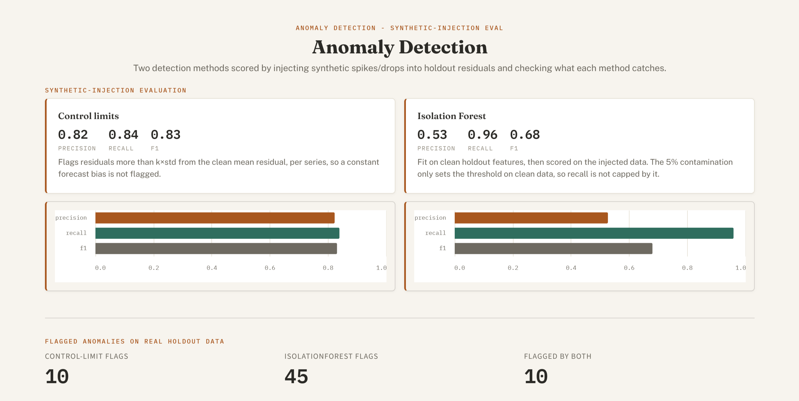
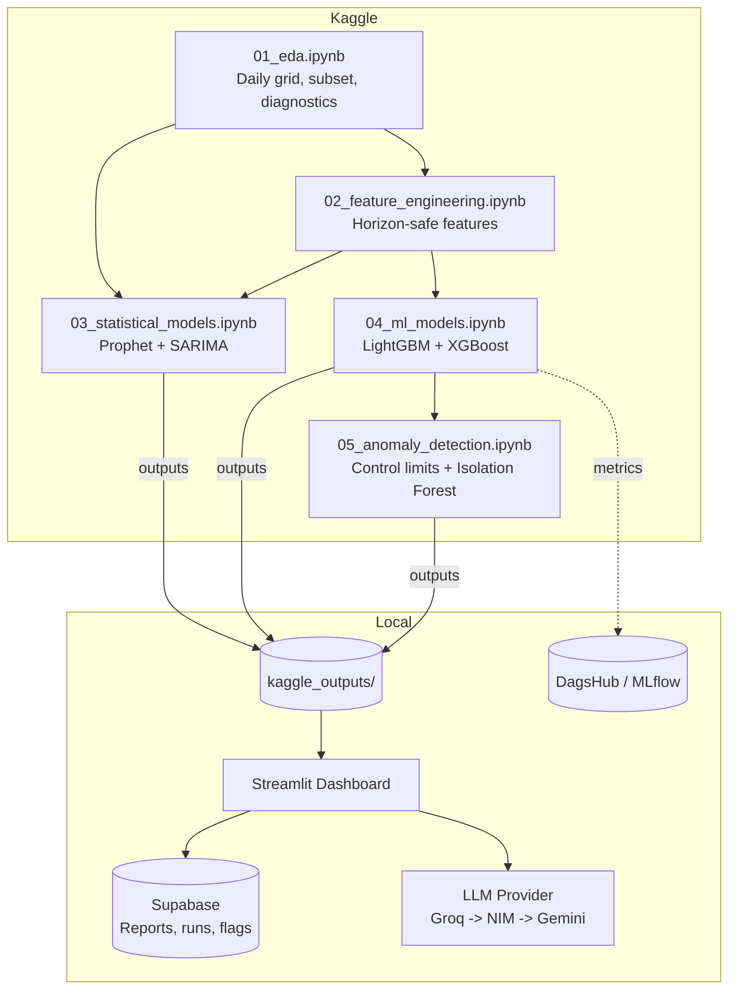

# DemandLens

**Retail Demand Forecasting & Anomaly Benchmark**

A retail demand forecasting and anomaly detection pipeline that benchmarks Prophet, SARIMA, LightGBM, and XGBoost across 60 retail series using expanding-window walk-forward cross-validation. It uses Kaggle’s free notebooks for training, Supabase’s free Postgres tier for storage, and free-tier Groq/NIM/Gemini APIs for automated reporting with provider fallback.

The project separates heavy computation from a lightweight local Streamlit dashboard. The LLM generates narrative reports and verifies every numeric claim against the original source data before displaying it. Reports are automatically saved to Supabase and can be downloaded as Markdown, including previous reports from the dashboard’s history.

## Preview

<p align="center">
  
  <br>
  <sub>Anomaly Detection view (Synthetic-Injection evaluation)</sub>
</p>

> Additional screenshots in [`assets/`](assets/), one per dashboard view.

## Architecture



## Results

One run of notebooks 01 to 05: 60 series, 15-day holdout (Aug 1 to Aug 15, 2017, 900 rows). The dashboard reads the same figures from `kaggle_outputs/`.

**Forecasting (holdout):**

| Model | Series | MASE | MAPE | WAPE |
|---|---|---|---|---|
| LightGBM | 60 | 0.974 | 17.88% | 17.73% |
| Prophet | 60 | 0.996 | 17.97% | 18.18% |
| **XGBoost** (selected on CV) | 60 | 1.011 | 19.44% | 18.61% |
| SARIMA | 3 | 0.838 | 13.26% | 14.84% |

SARIMA covers only 3 series, so compare it like-for-like on those (MASE): Prophet 0.793, SARIMA 0.838, LightGBM 0.919, XGBoost 0.933.

- **No clear winner.** The three 60-series models are within 0.04 MASE of each other. No significance test is included in the repo.
- **Selection ignores the holdout.** XGBoost was chosen on mean MASE over the 4 CV folds (0.866 vs 0.902 for LightGBM), even though LightGBM scores slightly better on the holdout.
- **Metric definitions.** Metrics are computed per series, then averaged. MASE is scaled by each series' in-sample seasonal-naive (lag-7) error, so it is not a comparison against a naive forecast on the holdout.
- **Leakage control.** ML features use lags of at least 21 days, and rolling stats and oil price are shifted by the horizon, so no feature sees in-window actuals.

**Anomaly detection (50 injected spikes and drops among 900 holdout rows):**

| Method | Precision | Recall | F1 |
|---|---|---|---|
| Control limits (k=2.5) | 0.824 | 0.84 | 0.832 |
| Isolation Forest (5% contamination) | 0.527 | 0.96 | 0.681 |

- Control limits: 42 true and 9 false positives. They are centered on each series' clean mean residual, so a constant forecast bias is not flagged.
- Isolation Forest: 48 of 50 caught, but about 43 clean rows flagged, since 5% contamination flags about 5% of clean data by construction.
- Scores measure how detectable injected anomalies are, not performance on real incidents.

**Cost of error (illustrative, USD, holdout):** XGBoost about $224,480 and LightGBM about $225,702, a gap of about 0.5%. XGBoost has slightly lower total absolute error (321,086 vs 323,350 units) while LightGBM has slightly lower mean MASE, because MASE weights series equally and cost weights by volume.

## Tech stack

| Layer | Tools |
|---|---|
| Modeling | Prophet, statsmodels (SARIMAX), LightGBM, XGBoost, scikit-learn (IsolationForest) |
| Experiment tracking | MLflow via DagsHub |
| Dashboard | Streamlit, Altair |
| Storage | Supabase (Postgres) |
| LLM narrative | Groq, NVIDIA NIM, Google Gemini, with automatic fallback |

## Project structure

```
demand-lens/
├── kaggle/                               Runs on Kaggle, not locally
│   ├── kaggle_setup.md                   setup, secrets, inputs per notebook, run order
│   ├── requirements-ipynb.txt            version ranges for debugging installs (each notebook installs its own packages)
│   └── notebooks/
│       ├── 01_eda.ipynb                  daily grid, subsetting, activation diagnostics, STL, stationarity
│       ├── 02_feature_engineering.ipynb  horizon-safe lag/rolling/calendar features, demand patterns
│       ├── 03_statistical_models.ipynb   Prophet (60 series) + SARIMA with regressors (3 series)
│       ├── 04_ml_models.ipynb            global LightGBM + XGBoost, walk-forward CV, per-series metrics, MLflow
│       └── 05_anomaly_detection.ipynb    control limits + Isolation Forest, synthetic-anomaly eval
│
├── kaggle_outputs/                       downloaded from Kaggle after each run (git-ignored)
│
├── src/                                  local-only modules used by the dashboard
│   ├── llm/
│   │   ├── narrative.py                  facts, prompt, provider routing (Groq -> NIM -> Gemini), retry classification
│   │   └── grounding_check.py            extracts numeric claims, verifies them against the facts by type
│   ├── storage/
│   │   └── supabase_client.py            upsert/fetch forecast runs and anomaly flags, save/fetch reports
│   ├── tracking/
│   │   └── mlflow_utils.py               past DagsHub/MLflow runs for Forecast Explorer
│   └── utils/
│       ├── config.py                     loads config.yaml and env vars, resolves paths against the repo root
│       ├── metrics.py                    MAPE/WAPE/MASE, single source of truth (see scripts/sync_notebook_metrics.py)
│       └── results.py                    model selection and comparison tables, shared by dashboard and LLM facts
│
├── scripts/
│   ├── sync_notebook_metrics.py          copies src/utils/metrics.py into the notebooks that cannot import it
│   ├── smoke_test_notebook_fixes.py      runs notebook functions on synthetic data (no Kaggle needed)
│   └── _notebook_utils.py                shared .ipynb parsing helpers
│
├── dashboard/
│   ├── app.py                            st.navigation router, page config
│   ├── theme.py                          design tokens, CSS and Altair helpers
│   └── views/                            home, overview, forecast_explorer, anomaly_view, ai_report
│
├── .streamlit/config.toml                light theme, colors checked by a test against theme.py tokens
├── configs/config.yaml                   runtime settings (data files, LLM, grounding) plus notebook parameters mirrored here and test-checked
├── tests/                                52 tests, see Testing
├── .env.example                          LLM keys, Supabase URL + key, DagsHub token + repo
├── .gitignore
├── requirements.txt                      dashboard runtime and test dependencies
└── README.md
```

## Setup

**1. Kaggle.** Run notebooks `01_eda` to `05_anomaly_detection` in order, attaching upstream outputs as described in [`kaggle/kaggle_setup.md`](kaggle/kaggle_setup.md). Notebooks find inputs by filename, so attach exactly one version of each. Download these 10 files from the latest run of each notebook into `kaggle_outputs/` at the repo root (git-ignored): `subset_config.json`, `stationarity_results.csv`, `demand_pattern_classification.csv`, `prophet_results.csv`, `sarima_results.csv`, `ml_results.csv`, `final_holdout_predictions.parquet`, `anomaly_results.parquet`, `anomaly_eval_metrics.csv`, `cost_of_error.json`.

**2. Dependencies.**

```bash
pip install -r requirements.txt
```

**3. Environment.**

```bash
cp .env.example .env
```

Set at least one LLM key (`GROQ_API_KEY`, `NIM_API_KEY`, `GEMINI_API_KEY`), plus `SUPABASE_URL` and `SUPABASE_KEY` (the secret key, which bypasses row level security). `DAGSHUB_TOKEN` and `DAGSHUB_REPO` are optional; without them only the "Experiment history" section of Forecast Explorer is empty.

**4. Supabase tables.** Run in the SQL editor:

```sql
create table reports (
  id uuid primary key default gen_random_uuid(),
  created_at timestamptz default now(),
  report_text text not null,
  facts jsonb not null,
  provider text not null,
  grounding_ratio float8 not null
);

create table forecast_runs (
  id uuid primary key default gen_random_uuid(),
  created_at timestamptz default now(),
  model text not null,
  source text not null,
  fold text not null,
  n_series int,
  mape float8,
  wape float8,
  mase float8,
  unique (model, source, fold)
);

create table anomaly_flags (
  id uuid primary key default gen_random_uuid(),
  created_at timestamptz default now(),
  date date not null,
  store_nbr int not null,
  family text not null,
  sales float8,
  forecast float8,
  residual float8,
  control_limit_flag int,
  isoforest_flag int,
  unique (date, store_nbr, family)
);

alter table reports enable row level security;
alter table forecast_runs enable row level security;
alter table anomaly_flags enable row level security;
```

With RLS enabled and no policies, the public anon key cannot read these tables. The logging buttons upsert on the unique keys, so repeated clicks update rows (and refresh `created_at`) instead of duplicating them. Reports are append-only.

**5. Run.**

```bash
streamlit run dashboard/app.py
```

Paths resolve against the repo root, so it works from any directory. Pipeline numbers come from `kaggle_outputs/`, logged history from Supabase, and run history from DagsHub. `src/utils/results.py` feeds both the dashboard and the LLM facts, so they agree on the selected model and every comparison figure.

## Testing

```bash
pytest tests/ -v
```

Notebooks 03 and 04 run on Kaggle and cannot import `src`, so they carry copies of `mape`, `wape` and `mase`. After changing `src/utils/metrics.py`, run `python scripts/sync_notebook_metrics.py`; a test fails if the copies drift.

Beyond unit tests for metrics, model selection, grounding and provider retry, the suite parses the notebooks with `ast` to check that `config.yaml` matches their constants (horizon, folds, anomaly parameters, lag-vs-horizon), validates each `.ipynb` against the nbformat schema, and runs notebook functions on synthetic data to check leakage, fold construction and anomaly injection.

## Known limitations

- **Backtest only.** 15-day holdout with known actuals. `onpromotion` and `is_holiday` are assumed known at forecast time, though promotion plans may not exist 15 days ahead.
- **Data handling.** National holidays only. Days missing from `train.csv` become zero sales and promotions (closed stores assumed).
- **Model comparability.** SARIMA covers 3 series (CPU-bound grid search), so use the like-for-like table. Direct multi-step ML forecasts avoid leakage but skip about the last two weeks before the origin, so they are less accurate than one-step models. Prophet and SARIMA also forecast blind.
- **Illustrative costs.** Per-unit costs are assumed grocery margins, not this business's P&L.
- **Regex grounding check.** It misses paraphrases without a literal number, flags correct numbers absent from the facts, and matches each claim to the closest fact of a compatible type, so a wrong figure can ground against an unrelated correct one. Reports with no numeric claims show as unverifiable.
- **Synthetic anomaly evaluation.** Flags on the real holdout (fit and scored on the same data) have no ground truth.